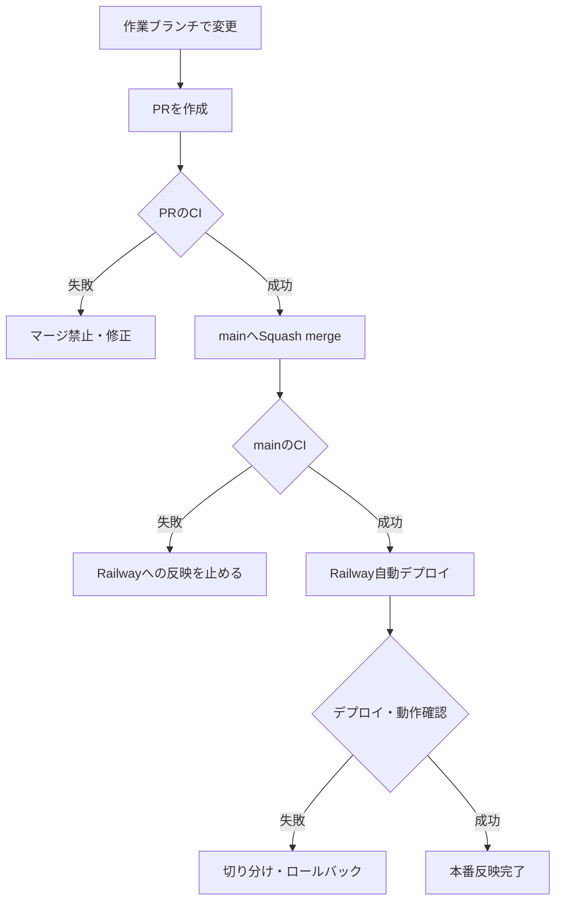

# CI/CDの流れ図（第13回）

Git×Railway上級マスター応用編 第13回「CI/CD完成形」のまとめ。開発から公開までを一本の流れにし、どこで失敗すると何が止まるかを整理する。

---

## 流れ図

---

## 今回の実績（PR #13）

- 変更内容: バージョン表示を`v1.0`から`v1.1`へ変更
- PRのCI: 成功
- マージ方式: 通常のSquash merge（`--admin`不使用）
- mainのCI: 成功
- Railway自動デプロイ: 成功
- 本番表示（`v1.1`）と既存機能（記録・連続記録・天気API・応援コメント・ジグソーパズル）: 確認済み

---

## 設計判断の一言

変更は作業ブランチとPRを経由し、CI成功後にのみmainへマージする。mainへの反映を起点にRailwayへ自動デプロイし、最後に本番画面と既存機能を確認することで、開発から公開までを一本の安全な流れにした。
