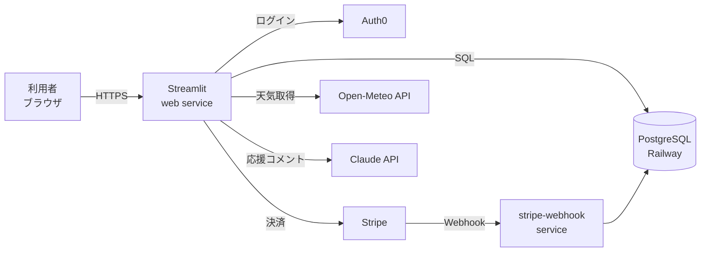

# 現行仕様書(2026-09-09時点)

第26課題(納品パッケージ)の一部として作成。`仕様書/仕様書.md`(第18・19課題のヒアリングメモ、履歴として保存)を上書きせず、**現時点でこのアプリが実際に何であるか**を独立にまとめた最新版の仕様書。個々の機能の詳細設計は各`仕様書/*設計.md`を参照し、本書はその全体地図として使う。

---

## ① 3行仕様(現在)

- 誰に: 食器洗いサポートを使う世帯(家族・同居人)のみんなに
- 何を: 食後の食器洗いを記録し、連続記録・達成感を見える化しつつ、複数世帯が安全に共存できるSaaSとして提供する
- どう動く: 「洗った」ボタンを押すと記録され、連続記録・月間パズルが育つ。世帯ごとにログイン・課金・利用状況が独立して管理される

第19課題時点の3行仕様(単一世帯のMVP)から、第16〜21回(SaaS本体編)を経て、マルチテナントSaaSへ発展している。

---

## ② 機能一覧

| 機能 | 状態 | 主な実装場所 |
|---|---|---|
| 記録・連続記録・最長記録 | production稼働中 | `streamlit/logic.py` |
| 月間ジグソーパズル(月替わりイラスト) | production稼働中 | `streamlit/illustrations.py` |
| 天気表示(Open-Meteo) | production稼働中 | `streamlit/app.py` |
| Claudeによる応援コメント | production稼働中(要`ANTHROPIC_API_KEY`) | `streamlit/encourage.py` |
| マルチテナント(世帯分離) | stagingのみ(第16回) | `streamlit/storage.py`, `scripts/migrate_to_tenant_schema.py` |
| ログイン・権限(Auth0) | stagingのみ(第17回) | `streamlit/auth.py`, `streamlit/authz.py` |
| 課金(Stripe、Free/Standard) | stagingのみ・テストモード限定(第18回) | `streamlit/billing.py` |
| 継続課金Webhook | stagingのみ(第19回) | `streamlit/webhook.py`, `scripts/webhook_server.py` |
| プラン制限・メータリング | stagingのみ(第20回) | `streamlit/metering.py` |
| セキュリティ堅牢化(入力検証等) | stagingのみ(第21回) | `streamlit/storage.py`ほか各モジュール |
| PostgreSQL最小権限化・RLS | staging適用済み(第22課題関連、PR #29) | `scripts/least_privilege_lib.py`ほか |
| キーワード検索・並び替え | **未マージ**(PR #30、第22課題) | `streamlit/db.py`, `streamlit/storage.py` |
| 本番migration安全化(接続先確認・バックアップ前提) | **コード完成・未PR**(`feature/production-migration-safety`) | `scripts/production_target_identity.py` |
| いじわる入力への耐性(落ちない化) | staging適用済み(第25課題) | `streamlit/storage.py`(`apply_tenant_rename`) |

---

## ③ アーキテクチャ概要

- **フロントエンド/バックエンド一体**: Streamlitが画面とロジックを兼ねる。UIコードは`streamlit/app.py`、業務ロジックは`streamlit/*.py`各モジュールに分離
- **データベース**: PostgreSQL(Railway上でホスト)。旧JSON保存方式(`streamlit/data/records.json`)は`STORAGE_BACKEND`環境変数で切替可能な形で残しているが、マルチテナント以降の機能はpostgres専用
- **認証**: Auth0(外部IdP)。`users`/`tenant_memberships`テーブルで「誰がどの世帯にどのroleで属するか」のみ自前管理し、パスワード等の認証情報自体は一切保持しない
- **決済**: Stripe(現在テストモードのみ)。Webhookは専用の`stripe-webhook`サービスで受信
- **デプロイ**: Railway(production/staging 2環境)、GitHub Actions CIがpush・PRごとに`pytest`を実行

---

## ④ 環境とブランチの現状(2026-09-09時点)

| ブランチ/環境 | 内容 |
|---|---|
| `main` → production(`www.piscavi.com`) | 第14回(本番DB運用)時点で止まっている。**第16〜25回の全機能が未反映**(48コミット分の差分がある) |
| `staging` → staging環境(`web-staging-beab.up.railway.app`) | 第16〜25回まで反映済み。最新は第25課題(PR #31マージ、`f139d3a`) |
| `feature/records-memo-search`(PR #30) | 検索・並び替え機能。PR #29(最小権限化)との関数不足の懸念があり**マージ保留中** |
| `feature/production-migration-safety` | 第16〜20回を本番へ安全に適用するための接続先確認・バックアップ前提の仕組み。**コードは完成・push済みだがPR未作成**(本番バックアップ・復元試験が先行条件) |

**なぜmainがこれほど遅れているか**: 第22課題(検索できるDB)のstaging適用完了・本番反映の可否判断が済むまで、第16〜21回をまとめてproduction/mainへ反映しない、という岩瀬様の方針による意図的な凍結。詳細は`課題ログ.md`の第22課題セクション、および冒頭の「未完了・要フォローアップ一覧」を参照。

---

## ⑤ 未確定・今後の判断が必要な点

- Auth0・Stripeの本番アカウント準備状況(現状は開発/テスト用の設定のみ確認済み、本番テナント・本番アカウントの要否は未着手)
- PR #30(検索機能)とPR #29(最小権限化)の統合方針(案A=SECURITY DEFINER関数化は実装済み・監査待ち)
- `feature/production-migration-safety`のPR化タイミング(本番バックアップ・復元試験の実施後)

各項目の経緯は`課題ログ.md`の該当セクションに詳細を記録している。
