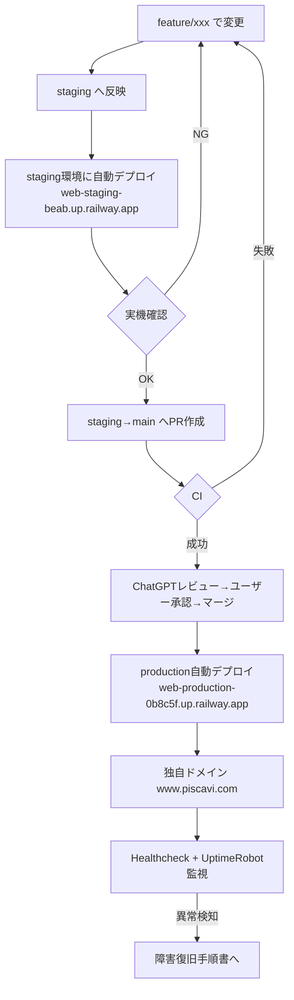

# 開発〜運用の型（1枚）

Git×Railway上級マスター応用編 第15回「本番運用の総合演習」のまとめ。ブランチ運用・CI/CD・環境分離・監視・復旧を、1枚の全体図として整理する。個々の詳細は各資料を参照。

---

## ① 全体図

---

## ② 4つの層

| 層 | 役割 | 参照資料 |
|---|---|---|
| **ブランチ運用** | `feature/xxx`で開発 → `staging`で検証 → PR承認後`main`へ | [`リリース手順.md`](./リリース手順.md) |
| **CI/CD** | PRのCI・mainのCI（Wait for CI）成功時のみRailwayが自動デプロイ | [`CI-CD流れ図.md`](./CI-CD流れ図.md) |
| **環境分離** | staging（検証用・持続環境）とproduction（本番）は別Railway環境。データ変更もstaging先行 | [`本番DB運用.md`](./本番DB運用.md) |
| **監視・復旧** | Healthcheck（`/_stcore/health`）＋外部監視（UptimeRobot）で気づき、症状別に対応 | [`障害復旧手順書.md`](./障害復旧手順書.md) |

---

## ③ 公開URLの構成（第15回時点）

| URL | 用途 | 状態 |
|---|---|---|
| `web-production-0b8c5f.up.railway.app` | 常時稼働するフォールバックURL | 稼働中 |
| `www.piscavi.com` | 独自ドメイン（利用者向けの正式URL） | DNS設定・ネームサーバー変更済み、反映待ち |
| `web-staging-beab.up.railway.app` | 検証専用（実機確認用） | 稼働中 |

---

## ④ この型を貫く3原則

1. **stagingを必ず経由する**：コード変更もデータ変更（復元含む）も、まずstagingで確認してからmainへ・productionへ
2. **失敗したら戻せる状態を保つ**：Gitの`revert`／Railwayの「Redeploy」ロールバック／バックアップからの`restore_data`、いずれも即座に使える
3. **気づく仕組みを二重化する**：Railway内部のHealthcheckと、外部のUptimeRobot監視。片方が落ちてももう片方で気づける

---

## 関連

- ブランチ運用・PRの実コマンド：[`リリース手順.md`](./リリース手順.md)
- CI/CDの流れ図：[`CI-CD流れ図.md`](./CI-CD流れ図.md)
- 永続Volume・バックアップ・復元・本番DB変更チェックリスト：[`本番DB運用.md`](./本番DB運用.md)
- 障害の症状別対応表：[`障害復旧手順書.md`](./障害復旧手順書.md)
